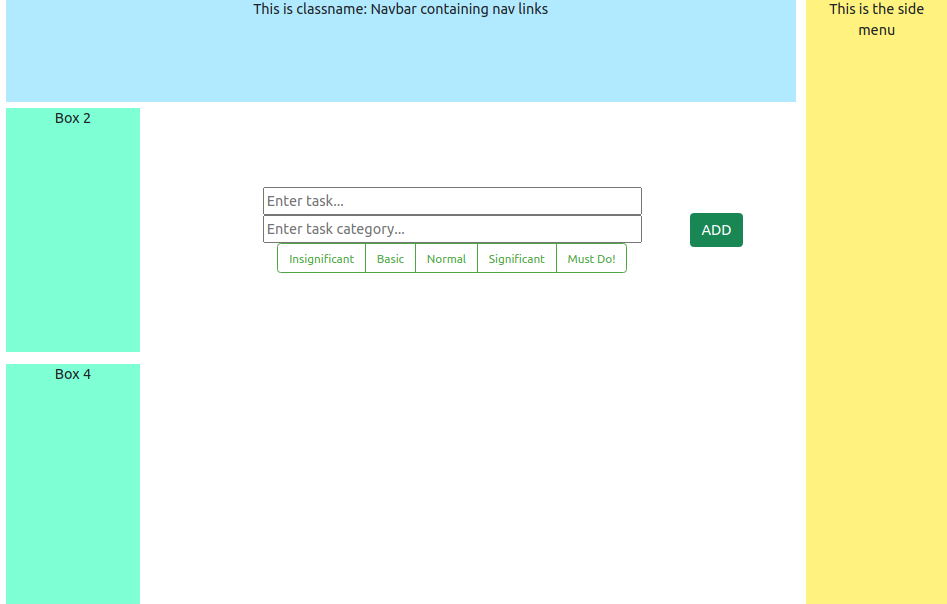
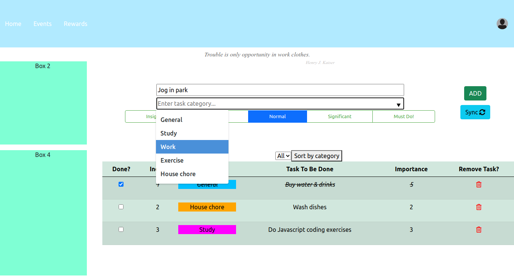

# Project Sandman

## Story

Project Sandman intends to develop a task manager with the intend to add a gamefication paradigm in extension.

## Features
Task manager implemented
Can keep track of tasks, assign to a category, delete tasks from list.

## Planned features
Add a login feature
Improve the UI and add a gamefication paradigm - finishing tasks will gain you XP or rewards.

## Technologies
- Back-end: Spring Boot
- Front-end: React.js
- extra feature JWT (JSON Web Token) for authentication -- available at security-with-jwt branch